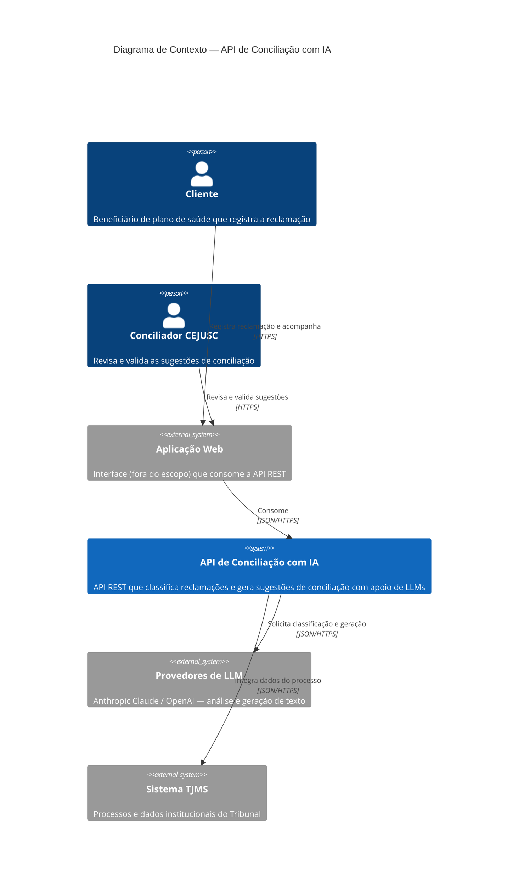
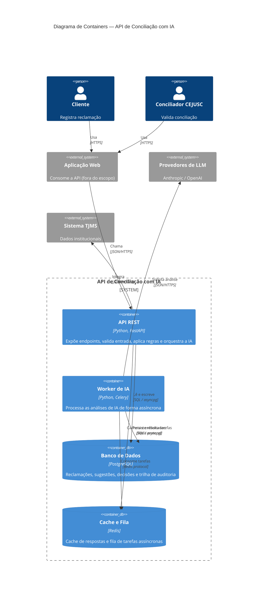
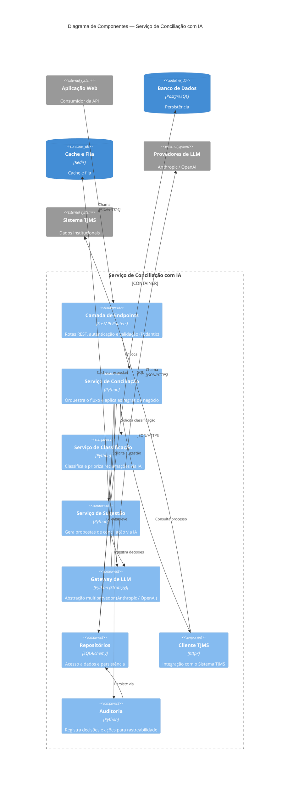
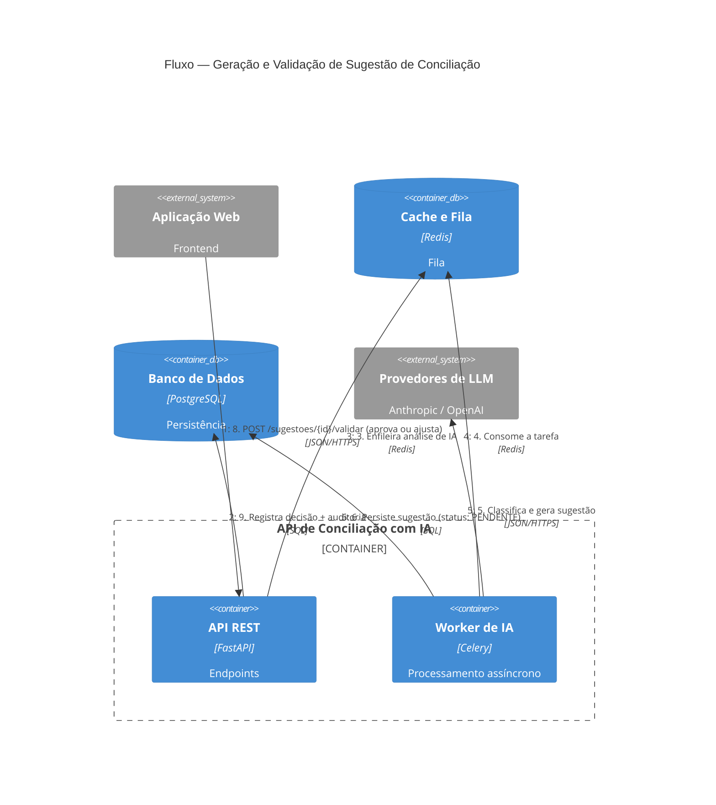
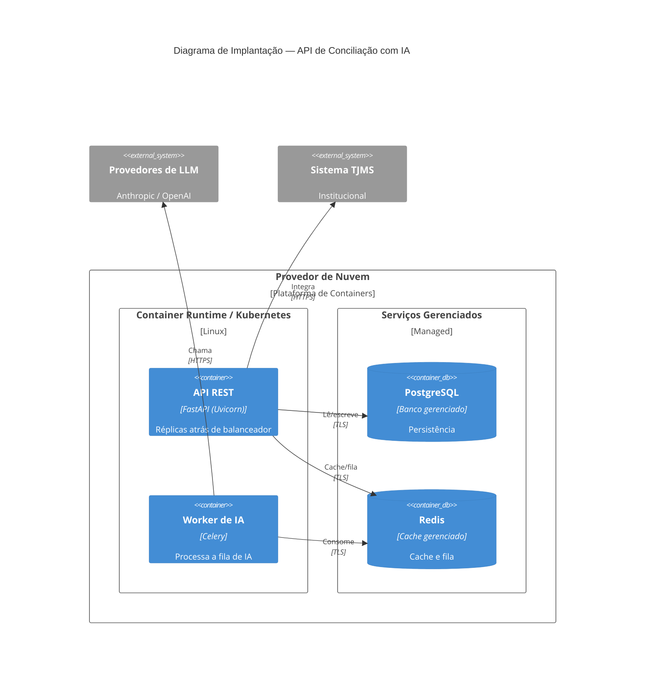

# Visões Arquiteturais — API de Conciliação com IA

> Documento de visões arquiteturais da **API de Conciliação com IA**, serviço de
> apoio à resolução de demandas de **saúde suplementar** antes da judicialização,
> no contexto do **CEJUSC / TJMS** (Tribunal de Justiça de Mato Grosso do Sul).
>
> Modelo de representação: **C4** (Context, Container e Component, com visões
> Dinâmica e de Implantação complementares). Os diagramas são versionados em
> Mermaid, junto ao código, acompanhando a evolução do projeto.

---

## 1. Introdução

A judicialização de demandas de **saúde suplementar** (negativas de cobertura,
autorizações de procedimentos, reembolsos) sobrecarrega o Judiciário. O CEJUSC
(Centro Judiciário de Solução de Conflitos e Cidadania) atua na **conciliação
pré-processual**: busca-se resolver o conflito entre cidadão e operadora de
plano de saúde **antes** de virar processo.

A **API de Conciliação com IA** é o serviço de back-end que apoia esse processo.
Ela recebe a reclamação do cidadão, **classifica e prioriza** a demanda e **gera
sugestões de conciliação** com apoio de modelos de linguagem (LLMs). As sugestões
**nunca** são aplicadas automaticamente: passam pela **validação humana** de um
conciliador do CEJUSC, que mantém o controle da decisão.

Este documento descreve a arquitetura **apenas da API REST** — o componente que o
grupo desenvolve. Interfaces de usuário (web/mobile), o Sistema TJMS e os
provedores de LLM são tratados como **sistemas externos**.

---

## 2. Escopo e delimitação

| Dentro do escopo (o que construímos) | Fora do escopo (externo) |
|--------------------------------------|--------------------------|
| API REST de processamento de IA | Aplicação Web / Frontend (consumidor) |
| Regras de negócio da conciliação | Provedores de LLM (Anthropic / OpenAI) |
| Classificação e geração de sugestões | Sistema TJMS (processos institucionais) |
| Persistência, cache e fila assíncrona | Autenticação federada / identidade dos usuários |
| Trilha de auditoria das decisões | Infraestrutura de nuvem gerenciada |

A aplicação é, deliberadamente, **uma única API REST** que concentra todo o
processamento de IA (ver [ADR-0001](adr/0001-aplicacao-como-api-rest-unica.md)).

---

## 3. Drivers arquiteturais

Os requisitos não funcionais (RNFs) que mais moldam a arquitetura:

| Driver | Por quê |
|--------|---------|
| **Confiabilidade da decisão** | A IA é probabilística e pode errar/alucinar; a decisão final precisa ser humana. |
| **Segurança e privacidade** | Dados de saúde são sensíveis (LGPD, art. 11 — dados sensíveis). |
| **Auditabilidade** | É preciso rastrear quem decidiu o quê e com base em qual sugestão da IA. |
| **Resiliência a dependências externas** | LLMs e TJMS são externos, com latência e indisponibilidade variáveis. |
| **Escalabilidade** | Volume de demandas pode crescer e oscilar (picos). |
| **Portabilidade de fornecedor de IA** | Evitar lock-in em um único provedor de LLM. |

---

## 4. Visão de Contexto (C4 — Nível 1)

Mostra a API como uma unidade central e suas interações com pessoas e sistemas
externos.

**Atores**

- **Cliente** — beneficiário do plano de saúde; registra a reclamação e acompanha
  o andamento (via Aplicação Web).
- **Conciliador CEJUSC** — revisa e **valida** as propostas geradas pela IA,
  garantindo o controle humano.

**Sistemas externos**

- **Aplicação Web** — front-end consumidor da API (desenvolvido por outra
  frente/equipe; fora do escopo deste documento).
- **Provedores de LLM** — Anthropic Claude / OpenAI; executam a análise
  inteligente. Acessados via camada de abstração (ver
  [ADR-0003](adr/0003-abstracao-multiprovedor-llm.md)).
- **Sistema TJMS** — integração com dados institucionais e processos.

---

## 5. Visão de Containers (C4 — Nível 2)

Detalha os blocos tecnológicos da API e suas responsabilidades. Todos os
containers internos compõem **um único serviço lógico** — a fronteira do sistema.

| Container | Tecnologia | Responsabilidade | ADR |
|-----------|-----------|------------------|-----|
| **API REST** | Python / FastAPI | Endpoints REST, validação (Pydantic), autenticação, orquestração das regras de negócio | [0002](adr/0002-python-fastapi.md), [0008](adr/0008-rest-json-como-estilo-de-api.md) |
| **Worker de IA** | Python / Celery | Executa chamadas de LLM (longas) de forma assíncrona, fora do ciclo HTTP | [0007](adr/0007-processamento-assincrono-de-ia.md) |
| **Banco de Dados** | PostgreSQL | Persistência relacional e trilha de auditoria | [0005](adr/0005-postgresql-persistencia-e-auditoria.md) |
| **Cache e Fila** | Redis | Cache de respostas/consultas e _broker_ da fila assíncrona | [0006](adr/0006-redis-cache-e-fila.md) |

> O processamento de IA é assíncrono porque chamadas a LLMs podem levar de
> segundos a dezenas de segundos. A API REST responde rápido (enfileira o
> trabalho) e o Worker processa em segundo plano.

---

## 6. Visão de Componentes (C4 — Nível 3)

Detalha a estrutura interna do código que compõe o serviço. Os componentes de
domínio (Classificação, Sugestão, Gateway de LLM) são **compartilhados** entre a
API REST e o Worker de IA — é o mesmo código, com pontos de entrada diferentes.

| Componente | Responsabilidade |
|-----------|------------------|
| **Camada de Endpoints** | Expõe as rotas REST, valida payloads, aplica autenticação/autorização. |
| **Serviço de Conciliação** | Orquestra o caso de uso: persiste a reclamação, dispara a análise de IA, consolida a sugestão e registra a decisão validada. |
| **Serviço de Classificação** | Classifica o tipo da demanda (ex.: negativa de procedimento, reembolso) e atribui prioridade. |
| **Serviço de Sugestão** | Gera a proposta de conciliação textual a partir do contexto da reclamação. |
| **Gateway de LLM** | Isola o resto do sistema do provedor de IA; permite trocar Anthropic↔OpenAI sem afetar o domínio ([ADR-0003](adr/0003-abstracao-multiprovedor-llm.md)). |
| **Repositórios** | Encapsulam o acesso ao PostgreSQL. |
| **Cliente TJMS** | Encapsula a integração HTTP com o Sistema TJMS. |
| **Auditoria** | Registra eventos de decisão para rastreabilidade ([ADR-0009](adr/0009-protecao-de-dados-de-saude-e-lgpd.md)). |

---

## 7. Visão Dinâmica — fluxo de conciliação (C4 Dynamic)

Cenário principal (+1, na linguagem do 4+1): da reclamação à decisão validada,
evidenciando o **controle humano**.

Observe que entre os passos **6** e **8** existe sempre uma **revisão humana**: a
sugestão fica `PENDENTE` até o conciliador aprovar ou ajustar
([ADR-0004](adr/0004-validacao-humana-obrigatoria.md)).

---

## 8. Visão de Implantação (C4 Deployment)

A API REST escala horizontalmente (réplicas _stateless_ atrás de balanceador); o
Worker de IA escala de forma independente conforme a profundidade da fila. Banco
e cache são serviços gerenciados.

---

## 9. Uso da Inteligência Artificial e controle humano

A IA é **suporte ao processo decisório**, aplicada em:

- **Classificação automática** das reclamações (tipo e prioridade);
- **Geração de sugestões** de conciliação;
- **Apoio à priorização** das demandas.

**Salvaguardas (decisão de projeto):**

- A IA é probabilística e pode apresentar erros/alucinações.
- A **decisão final é sempre do conciliador** — sugestões ficam `PENDENTE` até
  validação humana.
- Toda decisão é **auditada** (sugestão original da IA + ação do conciliador).

Ver [ADR-0004](adr/0004-validacao-humana-obrigatoria.md).

---

## 10. Requisitos Não Funcionais (RNFs)

| RNF | Como a arquitetura atende |
|-----|---------------------------|
| **Performance** | Resposta rápida da API via processamento assíncrono + cache (Redis). |
| **Segurança** | TLS, dados de saúde criptografados, controle de acesso, segredos de API protegidos ([ADR-0009](adr/0009-protecao-de-dados-de-saude-e-lgpd.md)). |
| **Disponibilidade** | API _stateless_ replicável; degradação controlada quando o LLM/TJMS falham. |
| **Escalabilidade** | API e Worker escalam de forma independente. |
| **Auditabilidade** | Trilha de auditoria persistida no PostgreSQL. |
| **Portabilidade** | Gateway de LLM multiprovedor evita _lock-in_ ([ADR-0003](adr/0003-abstracao-multiprovedor-llm.md)). |
| **Observabilidade** | Logs estruturados, métricas e _tracing_ ([ADR-0010](adr/0010-observabilidade.md)). |

---

## 11. Decisões Arquiteturais (ADRs)

Cada decisão estrutural está registrada como um ADR em [`docs/adr/`](adr/).

| ADR | Decisão | Status |
|-----|---------|--------|
| [0001](adr/0001-aplicacao-como-api-rest-unica.md) | Aplicação como **única API REST** (mono-serviço) | Aceito |
| [0002](adr/0002-python-fastapi.md) | **Python + FastAPI** como stack da API | Aceito |
| [0003](adr/0003-abstracao-multiprovedor-llm.md) | **Abstração multiprovedor** de LLM (Anthropic/OpenAI) | Aceito |
| [0004](adr/0004-validacao-humana-obrigatoria.md) | **Validação humana obrigatória** (human-in-the-loop) | Aceito |
| [0005](adr/0005-postgresql-persistencia-e-auditoria.md) | **PostgreSQL** para persistência e auditoria | Aceito |
| [0006](adr/0006-redis-cache-e-fila.md) | **Redis** para cache e fila | Aceito |
| [0007](adr/0007-processamento-assincrono-de-ia.md) | **Processamento assíncrono** de IA (fila + worker) | Aceito |
| [0008](adr/0008-rest-json-como-estilo-de-api.md) | **REST/JSON** como estilo de API | Aceito |
| [0009](adr/0009-protecao-de-dados-de-saude-e-lgpd.md) | **Proteção de dados de saúde / LGPD** | Aceito |
| [0010](adr/0010-observabilidade.md) | **Observabilidade** (logs, métricas, _tracing_) | Proposto |

---

## 12. Trade-offs

| Decisão | Benefício | Custo / Risco |
|---------|-----------|----------------|
| Uso de IA | Automação e ganho de eficiência | Erros/alucinação → mitigado por validação humana |
| API REST única | Simplicidade operacional, menos _overhead_ | Acoplamento interno maior que microsserviços |
| Abstração de LLM | Evita _lock-in_, troca de provedor | Camada extra, menor denominador comum entre APIs |
| Processamento assíncrono | API responsiva, resiliente a latência do LLM | Complexidade (fila, _eventual consistency_) |
| Cache (Redis) | Performance, menos chamadas repetidas | Consistência/_staleness_ do dado em cache |
| Integração externa (TJMS) | Reúso de dados institucionais | Dependência de disponibilidade externa |

---

## 13. Riscos técnicos e mitigação

| Risco | Mitigação |
|-------|-----------|
| Respostas incorretas da IA | Validação humana obrigatória + auditoria |
| Latência/indisponibilidade do LLM | Processamento assíncrono, _timeouts_, _retry_, _fallback_ entre provedores |
| Indisponibilidade do TJMS | Degradação controlada; reprocessamento posterior |
| Vazamento de dados sensíveis | Criptografia, controle de acesso, minimização de dados, LGPD |
| Custos de API de IA | Cache de respostas, escolha de modelo por tarefa, limites de uso |

---

## 14. Evolução do sistema

- Avaliação contínua da qualidade das sugestões (_feedback_ do conciliador → métricas).
- Observabilidade completa (logs, _tracing_ distribuído, métricas) — ver ADR-0010.
- Possível automação parcial de casos de baixa complexidade (sempre com revisão por amostragem).
- _Fine-tuning_ / RAG com base no histórico de conciliações.

---

## 15. Conclusão

A arquitetura equilibra **automação** e **controle humano**: a IA atua como
suporte, sem substituir a decisão do conciliador. Concentrar todo o processamento
em **uma única API REST** mantém a operação simples nesta fase do projeto, e a
separação clara de componentes — com o **Gateway de LLM** isolando o fornecedor de
IA e o **processamento assíncrono** absorvendo a latência externa — permite
evoluir o sistema com controle de riscos.

---

## Apêndice A — Diagramas legados (versão inicial)

As imagens abaixo representam a **primeira versão** da modelagem, que descrevia o
**sistema completo** (incluindo Frontend e back-end em Node.js). Foram mantidas
como histórico; as visões oficiais e atuais são os diagramas Mermaid acima
(API REST como sistema, em Python/FastAPI).

- 
- 

---

## Referências

- Simon Brown — **C4 model** (https://c4model.com)
- ADRs do projeto — [`docs/adr/`](adr/)
- LGPD — Lei nº 13.709/2018 (dados pessoais sensíveis de saúde)
