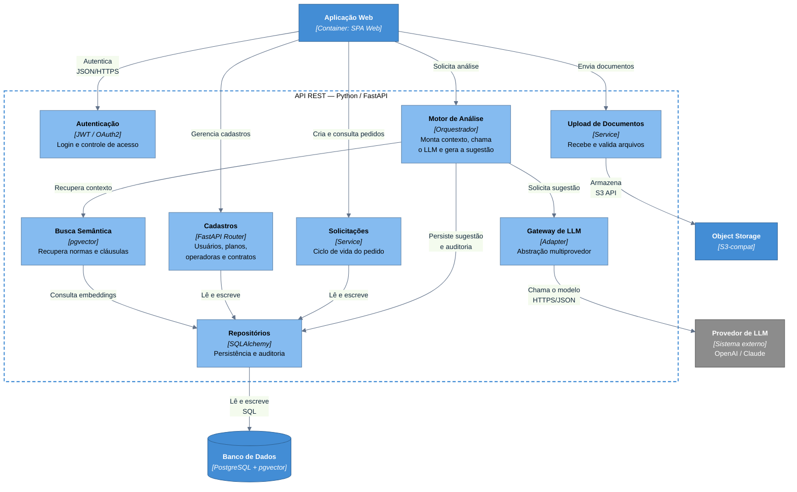

# C4 — Nível 3: Componente (API REST)

Zoom na **API REST**, o container desenvolvido pelo time. Público: desenvolvedores.

> Notação: **flowchart** seguindo as convenções do C4. A fronteira tracejada é o
> container **API REST**; os elementos internos são componentes (não implantáveis
> isoladamente).

| Componente | Papel | ADR |
|------------|-------|-----|
| **Autenticação** | Login e RBAC via JWT | [0004](../adr/0004-autenticacao-jwt.md) |
| **Cadastros / Solicitações** | CRUD e ciclo de vida dos pedidos | [0001](../adr/0001-api-rest-unica.md) |
| **Upload de Documentos** | Recebe contratos e documentos | [0010](../adr/0010-armazenamento-documentos.md) |
| **Motor de Análise** | Orquestra RAG + LLM + sugestão | [0008](../adr/0008-llm-multiprovedor.md), [0009](../adr/0009-validacao-humana.md) |
| **Busca Semântica** | Recupera normas da ANS e cláusulas | [0007](../adr/0007-pgvector-rag.md) |
| **Gateway de LLM** | Isola o provedor de IA | [0008](../adr/0008-llm-multiprovedor.md) |
| **Repositórios** | Persistência e auditoria | [0005](../adr/0005-postgresql-sqlalchemy.md), [0012](../adr/0012-explicabilidade-auditoria.md) |

## Notas

- Os **componentes** são módulos internos do container **API REST** — não são
  implantáveis isoladamente.
- O fluxo completo em execução está em
  [`c4-dynamic-conciliacao.md`](c4-dynamic-conciliacao.md).
