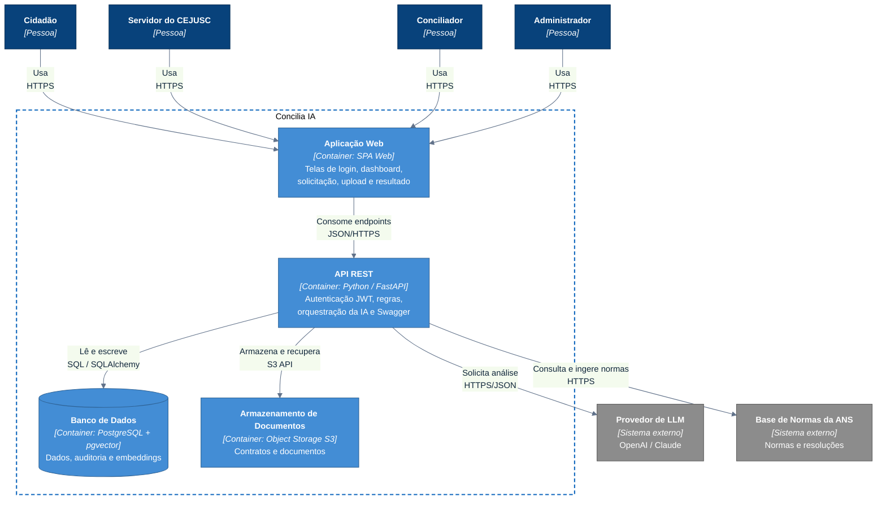

# C4 — Nível 2: Container (Concilia IA)

Detalha os blocos executáveis e de dados da solução. Público: técnico e produto.

> Notação: **flowchart** seguindo as convenções do C4. A fronteira tracejada é o
> sistema **Concilia IA**.

| Container | Tecnologia | Responsabilidade | ADR |
|-----------|-----------|------------------|-----|
| **Aplicação Web** | SPA Web | Interface das telas do MVP (consome a API) | — |
| **API REST** | Python / FastAPI | Endpoints, autenticação, regras, orquestração da IA | [0001](../adr/0001-api-rest-unica.md), [0002](../adr/0002-python-fastapi.md), [0003](../adr/0003-rest-json-openapi.md) |
| **Banco de Dados** | PostgreSQL + pgvector | Persistência, auditoria e busca semântica | [0005](../adr/0005-postgresql-sqlalchemy.md), [0007](../adr/0007-pgvector-rag.md) |
| **Armazenamento de Documentos** | Object Storage (S3) | Contratos e documentos do upload | [0010](../adr/0010-armazenamento-documentos.md) |

## Notas

- A **API REST é única** (mono-serviço) — ver [ADR-0001](../adr/0001-api-rest-unica.md).
- O **TJMS** não aparece aqui: é relação de contexto (Nível 1), sem integração
  técnica em nível de container no MVP.
- Detalhamento interno da API em [`c4-components-api.md`](c4-components-api.md).
