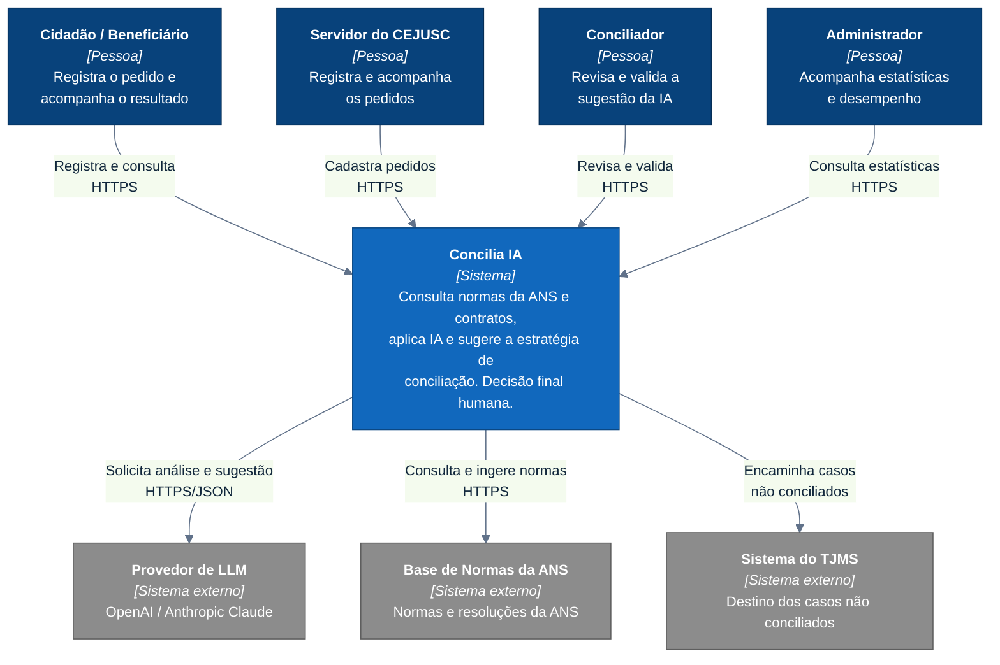

# C4 — Nível 1: Contexto (Concilia IA)

Mostra a **Concilia IA** como uma unidade e suas relações com pessoas e sistemas
externos. Público: todos os interessados.

> Notação: **flowchart** seguindo as convenções do C4 (melhor legibilidade que o
> `C4Context` nativo do Mermaid). Cores: azul-escuro = pessoa, azul = sistema em
> foco, cinza = sistema externo.

## Notas

- **Escopo:** a Concilia IA é o sistema em foco; **LLM**, **normas da ANS** e
  **TJMS** são externos (caixa-preta).
- A meta institucional é **reduzir o encaminhamento ao Juizado**: casos resolvidos
  na conciliação não viram processo.
- Decisões relacionadas: [ADR-0008 (LLM)](../adr/0008-llm-multiprovedor.md),
  [ADR-0009 (validação humana)](../adr/0009-validacao-humana.md).
