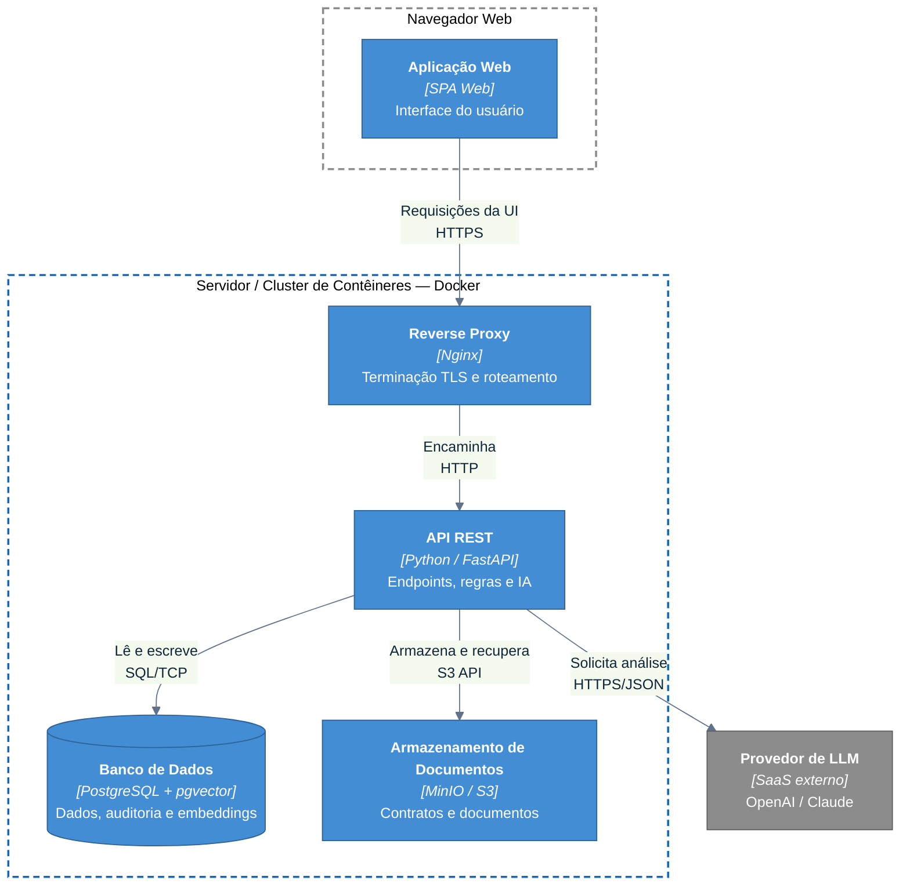

# C4 — Deployment: Produção (Docker)

Infraestrutura de implantação em **produção**, com os componentes empacotados em
**contêineres Docker**. Público: DevOps.

> Notação: **flowchart** seguindo as convenções do C4. Cada caixa tracejada é um
> nó de implantação (_deployment node_).

## Notas

- **Empacotamento com Docker** — ver [ADR-0011](../adr/0011-docker.md). Em
  desenvolvimento, os mesmos serviços sobem via **Docker Compose**.
- A **API é _stateless_** e pode ser replicada horizontalmente atrás do _reverse
  proxy_; o estado fica no **PostgreSQL** e no **object storage**.
- **Migrações Alembic** rodam como passo do _deploy_, antes de subir a API — ver
  [ADR-0006](../adr/0006-alembic-migracoes.md).
