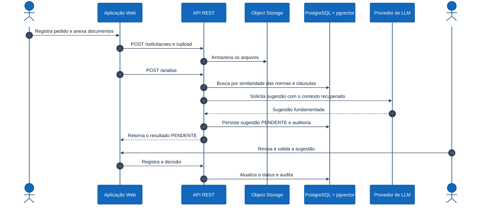

# C4 — Dinâmico: Fluxo do pedido à conciliação

Sequência numerada do fluxo principal: do registro do pedido até a validação
humana da sugestão. Público: técnico.

> Notação: **diagrama de sequência** (visão dinâmica do C4), com passos numerados
> automaticamente.

## Notas

- A sugestão nasce **`PENDENTE`** (passo 8) e só vira decisão após a **validação
  humana** (passos 10–12) — ver [ADR-0009](../adr/0009-validacao-humana.md).
- O contexto recuperado (passos 5–6) fundamenta a sugestão e é registrado na
  auditoria — ver [ADR-0007](../adr/0007-pgvector-rag.md) e
  [ADR-0012](../adr/0012-explicabilidade-auditoria.md).
